# **Journal de bord Sae21, Luigi MORETTI**

* **24 et 25 mars -> Découverte du sujet et répartition des tâches**

Je dois m'occuper de la partie virtuelle sur GNS3.

*  **08/04 -> Configuration DHCP + Nat partie virtuelle:**

J'ai configuré le DHCP et le NAT sur le routeur du réseau.
Pour cela il suffit d'entrer les commandes suivantes dans le routeur.

-conf t

-interface fastEthernet 0/0

-ip address 192.168.1.254 255.255.255.0

-no sh

-no shutdown

-exit

-ip dhcp pool toto

-network 192.168.1.0 255.255.255.0

-default-router 192.168.1.254

-dns-server 192.168.1.254

-class tata

-address range 192.168.1.2 192.168.1.252

Ensuite, on peut attribué une configuration a chaque pc automatiquement en entrant la commande dhclient sur chaque pc.

Maintenant on configure le NAT sur le routeur, pour cela on entre les commandes suivantes:

-conf t

-interface fastEthernet 0/0

-ip nat inside

-exit

-interface fastEthernet 0/1

-ip nat outside

-exit

-access-list 1 permit 192.168.1.0 0.0.0.255

-ip nat pool MY_POOL 10.213.0.0 10.213.255.254 netmask 255.255.0.0

-ip nat inside source list 1 pool MY_POOL

-exit

-write memory

* **15/04 -> Début configuration DNS (partie physique)**

Après réorganisation du groupe je dois maintenant m'occuper de la partie DNS et du serveur WEB pour la partie physique du projet.

* **21/04 -> Suite configuration DNS + serveur Web**

Tout d'abord on commence par installer bind9 avec la commande : apt install bind9 dnsutils. 
Pour lancer/arrêter le service il suffit de faire :  
systemctl start/stop bind9  

Pour connaître l’état du service :  
systemctl status bind9  

Après chaque modification il faut relancer le serveur avec : 
systemctl restart bind9 
 
**Après avoir installer bind9, je m'occupe de la configuration des fichiers suivant pour le DNS :**

* etc/bind/named.conf.local

On accède a ce fichier en entrant nano /etc/bind/named.conf.local.  
Grâce à ce fichier, on créé notre zone ici donc, DockerCoorporation.fr qui est le nom de notre entreprise.  
De plus ce fichier permet de déterminer si notre serveur DNS doit être master ou slave, on finit ensuite par indiquer où trouver le fichier de configuration de notre zone. 

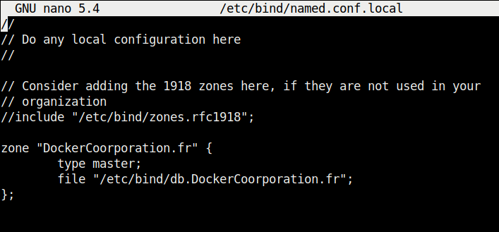

* etc/bind/named.conf.options

Après avoir configurer le fichier précédent on passe désormais au fichier named.conf.options, pour y accèder on tappe nano /etc/bind/named.conf.options.  
Ici on va simplement changer le forwarders en entrant 8.8.8.8.  
Grâce a cela la résolution des noms symboliques va d'abord passer par notre DNS et si elle n'y arrive pas elle sera redirigée vers le résolver de google qui est un résolver public, comme il est indiqué dans le cahier des charges.

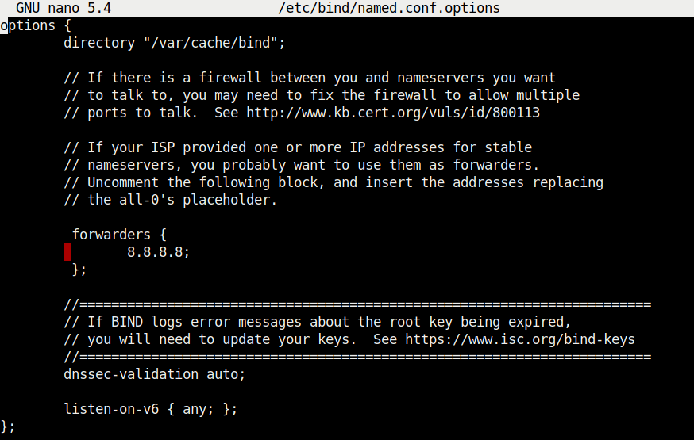

* etc/bind/db.DockerCoorporation.fr

Enfin, je finis par configurer le fichier db.DockerCoorporation.fr créé précédemment.  
Il est accèssible avec, nano /etc/bind/db.DockerCoorporation.fr  
Dans la 3 ligne, on va changer l'adresse par défaut et mettre celle du site web de notre site et ensuite on entre une email. Cette ligne ne changera rien aux paramètres du DNS mais elle servira en cas de problème avec ce dernier pour que les utilisateurs contactent le gérant du DNS.  
Ensuite on peut voir plusieurs paramètres qui configure le DNS mais dans notre cas il est inutile de les changer. 
La ligne @ IN NS dns.DockerCoorporation.fr, permet de dire que le serveur DNS s’appelle dns.DockerCoorporation.fr.
 
La ligne DNS IN A 10.214.16.1 indique ou se trouve le serveur DNS.
  Les deux lignes en dessous en 194.199.227.80 indique l'adresse IP du serveur web de l'iut ici pour effectuer des tests, le résultats final sera montrés le jour d'après.

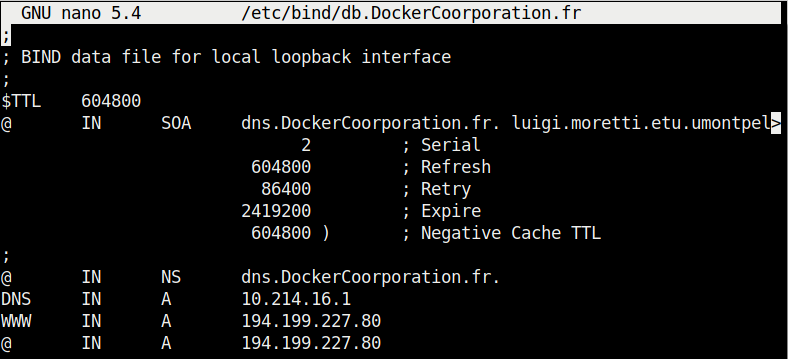

 

Evidemment après avoir effectué toutes ces modifications il faut relancer le serveur dns à l'aide de la commande : systemctl restart bind9.
 

 

* **22/04 -> Fin configuration DNS + serveur Web**

Durant cette journée j'ai fini la configuration DNS et celle du serveur web, j'ai changé de machione et donc repris les configurations précédentes en gardant ce qui était correcte et en changeant quelques détails.

Voici donc les fichiers précédents reconfigurés: 

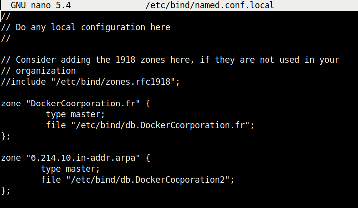

Ici on rajoute la zone reverse du serveur DNS.

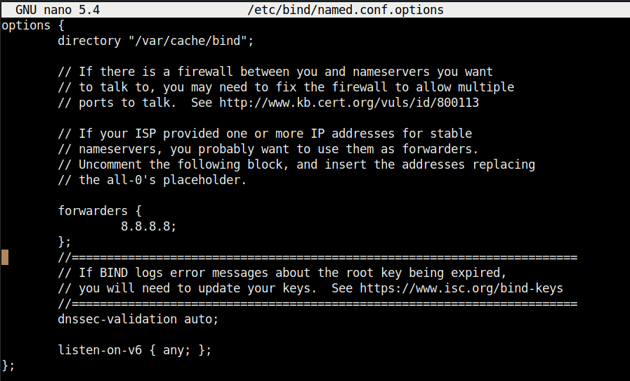

Rien ne change dans ce fichier.

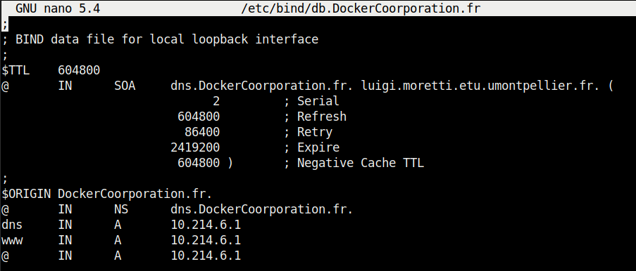

Et enfin on va ici changer l'addresse du serveur web de l'iut utilise pour des test et rajouter celle de notre serveur dns 10.214.6.1.  
De plus on ajoute la ligne $ORIGIN DockerCoorporation.fr., cette ligne permet d'attaché le nom de domaine à des enregistrements non-qualifiés, comme ceux qui spécifient seulement l'hôte et rien de plus.  
 
### **Une fois tout cela fait nous pouvons désormais commencer la configuration du serveur web.**
 
Pour cela, on commence par réinstaller le serveur apache2 sur notre machine pour être sur de partir avec une configuration par défaut :
 
apt autoremove 
apt purge apache2 
rm -r /var/www/ 
rm -r /etc/apache2/ 
apt install apache2 
 
Ensuite, on va déplacer notre code html et css dans le serveur apache2 pour afficher notre site web.  
mv Bureau/Web/texte.html /var/www/html/ 
mv Bureau/Web/style.css /var/www/html/ 
mv /var/www/html/texte.html /var/www/html/index.html 
 
Une fois cela effectuer, on va aller dans cd /etc/apache2/sites-available puis, on va copier le fichier 000-default.conf dans notre fichier DockerCoorporation.conf, pour cela on entre la commande cp 000-default.conf DockerCoorporation.conf 
  Ensuite on peut configurer ce fichier avec nano DockerCoorporation.conf.

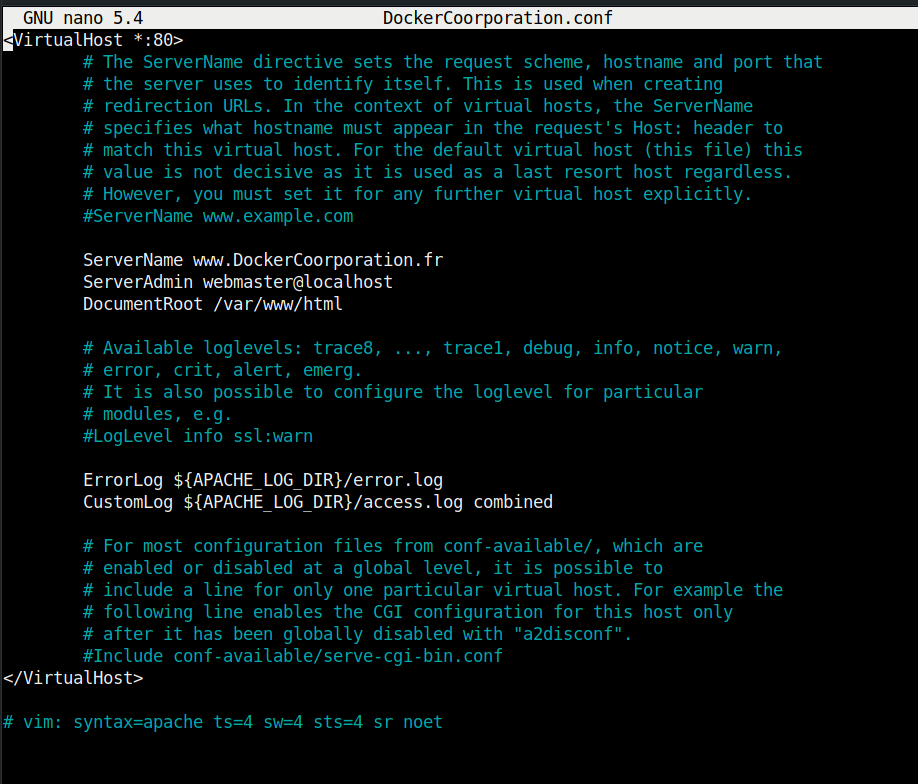

Dans ce fichier on va ajouter la ligne ServerName www.DockerCoorporation.fr.
 
Maintenant on peut lancer le serveur avec la commande : a2ensite DockerCoorporation.conf
 
Une fois cela fait il ne faut pas oublier de relance le serveur apache pour sauvegarder les modifications avec la commande suivante : systemctl restart apache2.
 
 
Maintenant il reste a configurer le fichier /etc/hosts et /etc/resolv.conf. 

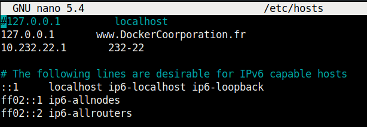

 

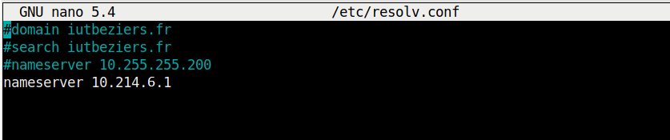

 

A présent on peut tester les configurations DNS et Web avec la commande dig et systemctl status apache2.
 

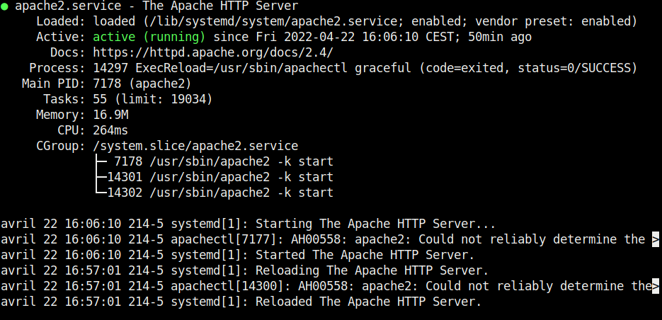

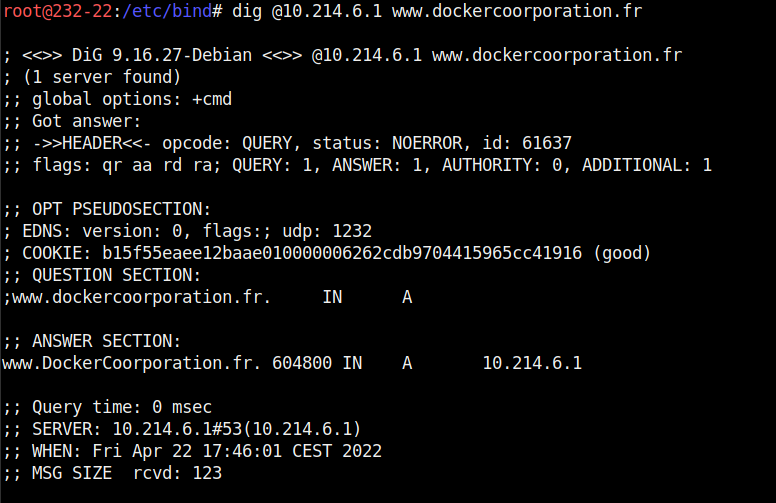

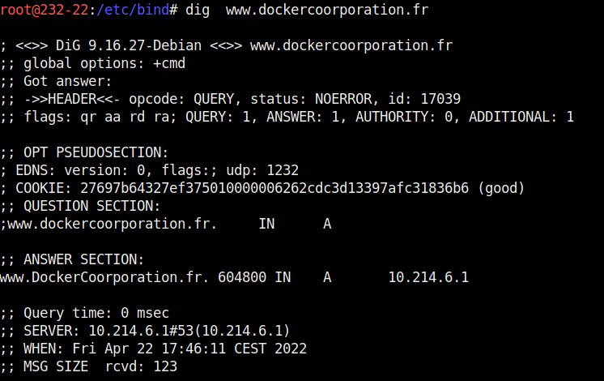

 
Désormais que tout est bon on peut bien accèder au serveur web DockerCoorporation.fr.
 
 

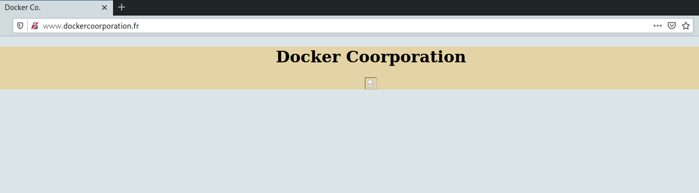
